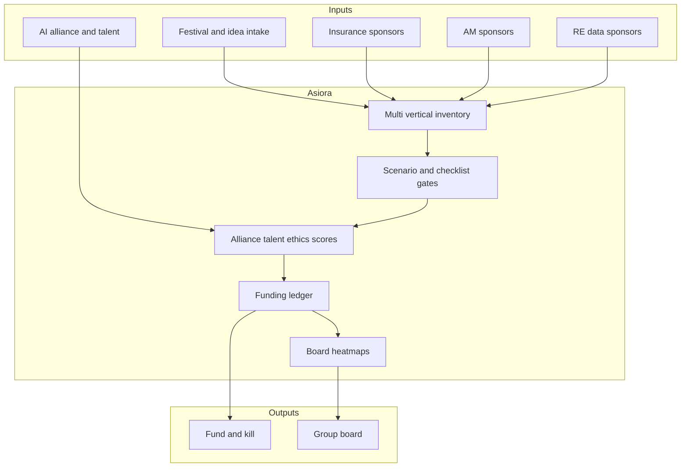

# Asiora

**Source:** `ai-in-financial/sea-fsi-fsireview-issue-19/`
**Domain:** `ai-fin`
**One-liner:** A Southeast Asia FSI transformation portfolio that helps regional financial groups pick and govern cross-vertical plays across AI operating shifts, insurance FinTech scenarios, asset-manager operating solutions, and real-estate data strategies—tuned for Singapore FinTech Festival–era competitive pressure.
**Wedge:** SEA financial conglomerates and national champions (bank + insurance + AM + property services) whose strategy offices drown in global WEF/Deloitte PDFs but lack a regional, multi-vertical decision system linking insurance futures, AM operating moves, and RE data bets.
**Positioning:** SEA FSI review theme—regional multi-vertical transformation OS. Distinct from Portiva/Autara (global New Physics AI portfolio / self-driving agent) and Morphora (CIO shapeshifter roles): Asiora’s wedge is the Issue 19 bundle’s *combination* of AI findings with insurance scenario planning, six AM forward solutions, and “data is the new gold” real-estate services—operated as one SEA portfolio.

## Market research synthesis

### Thesis from source

Deloitte Southeast Asia *FSIReview* Issue 19 (November 2018, FinTech Festival special) “unravels the future of financial services” for a regional audience. It opens with nine New Physics AI findings (cost-centre-to-profit-centre / CoE-as-a-service; new loyalty battlefield via customisation, attention, ecosystems; self-driving finance; collective solutions for shared problems such as fraud/AML; market bifurcation; uneasy data alliances; data-regulator power; talent as speed limit; new ethical dilemmas)—useful context but already productised elsewhere. The **differentiating** content for Asiora is what follows.

**Insurance FinTech catalyst:** sustainable profitable growth elusive; coverage gap persists; accidental disruption from Industry 4.0, future of mobility, genomics, wellness, connected home. Four scenarios—Changing the channel (embedded/InsurTech distribution), Underwriting by machine (outsourced AI UW), Rise of the flexible product (usage/event-driven, personal+commercial blur), E-Z life insurance (digital term in emerging markets)—force incumbents to choose postures rather than “digitise everything.”

**Asset management six solutions:** M&A to accelerate transformation (88% cite weak diligence as top deal failure cause; 78% cite integration failure); agile target operating models (process, controls, data, metrics, talent, organisation); plus further forward-looking plays in the issue (fee pressure, passive/active mix, fiduciary regulation). **Real estate services:** data collection/analysis as “new gold,” with recommended steps for providers to stay successful amid shifting drivers.

Asiora’s product insight: SEA groups need a **cross-vertical scenario portfolio**—score insurance scenario bets, AM operating/M&A moves, and RE data plays alongside AI alliance/talent constraints—rather than another standalone AI strategy deck.

### Buyer & economic model

- **Primary buyer:** Group Chief Strategy Officer or Regional FS Transformation Lead at a SEA bank-insurance-AM conglomerate or large insurer/AM with property adjacency.
- **Users:** insurance strategy, AM COO/strategy, RE services leaders, AI/data alliance managers, talent leads, risk/compliance for data alliances, board strategy committee.
- **Budget owner / value metric:** group transformation and vertical P&L investment funds. Metrics: capital allocated to explicit scenario postures; killed multi-vertical overlaps; time from festival/idea intake to funded experiment; diligence completeness on AM M&A; data-alliance risk scores.
- **Competing status quo:** separate insurance digital, AM ops, and property innovation teams; global WEF summaries copied into local decks; FinTech Festival booth tours without portfolio capture.

### Domain constraints

- **Regulatory / trust / safety:** national data localisation variance across SEA; insurance conduct and genetics-sensitive underwriting ethics; AM fiduciary duties; property data privacy; cross-border alliance constraints.
- **Data sensitivity:** multi-vertical customer data; M&A targets; alliance terms with competitors.
- **Change-management realities:** vertical P&Ls resist group portfolio kills; Asiora must make scenario choice and overlap visible at group exco.

## Business requirements

- BR-1: Every initiative must tag primary vertical (ai-ops, insurance, asset management, real estate services) and optional cross-vertical dependencies.
- BR-2: Insurance initiatives must declare a scenario posture (channel / machine-UW / flexible product / E-Z life / hybrid) or be flagged unpostured.
- BR-3: AM M&A and operating-model initiatives must attach diligence and integration risk checklists before scale funding.
- BR-4: RE data initiatives must state data sources, consent/localisation basis, and monetisation hypothesis.
- BR-5: Uneasy data alliances must score strategic hub-vs-periphery risk and regulatory feasibility by country.
- BR-6: Talent constraints must gate transformative AI and machine-UW bets when coverage gaps exceed policy.
- BR-7: Ethical/genomics/wellness underwriting plays require explicit ethics review flags before customer impact.
- BR-8: Collective-solution plays (shared fraud/AML) must identify consortium governance or be labelled unilateral.
- BR-9: Overlapping initiatives across verticals chasing the same customer outcome must be cluster-detected.
- BR-10: Festival/external idea intake must convert to portfolio items with owners within a defined SLA or expire.
- BR-11: Board packs must show multi-vertical heatmaps—not four disconnected appendices.
- BR-12: Asiora governs regional bets; it does not underwrite policies, run AM order management, or operate property IoT networks.

## User stories

Canonical user stories live in sibling [USER_STORIES.md](USER_STORIES.md).

## System design

### Overview

Asiora intakes ideas (including festival signals), classifies them by vertical and scenario, scores regulatory/alliance/talent risk, runs funding gates with overlap detection, and publishes group board packs. Execution systems stay in the verticals.

### Actors & boundaries

- **Actors:** group strategy, vertical leads, alliance/talent partners, risk, board readers.
- **Trust boundary:** M&A and alliance terms restricted; country regulatory notes need-to-know.
- **Human-in-the-loop points:** posture assignment, funding, kills, ethics waivers, pack publish.

### Core capabilities

1. **Multi-vertical initiative inventory**.
2. **Insurance scenario postureing**.
3. **AM diligence/integration gates**.
4. **RE data play register** — localisation and monetisation.
5. **Data-alliance risk scoring**.
6. **Talent and ethics gates**.
7. **Overlap clustering**.
8. **Festival/idea intake SLA**.
9. **Funding decision ledger**.
10. **Group board heatmap packs**.

### Conceptual data

- **Primary entities:** Initiative, Vertical, InsuranceScenario, DiligenceChecklist, DataPlay, AllianceScore, TalentGate, EthicsFlag, OverlapCluster, IdeaIntake, FundingDecision, CountryConstraint, BoardPack.
- **Critical events:** idea captured, posture set, diligence completed, alliance scored, talent gated, ethics flagged, funded/killed, pack published.
- **Retention / audit needs:** funding decisions and ethics flags retained for board/regulatory strategy inquiries; M&A diligence retained per deal policy.

### Integrations (conceptual)

- **Systems of record:** finance actuals, HR talent systems, TPRM/alliance registers, insurance product inventory, AM deal pipeline, property data platforms.
- **Upstream signals:** festival CRM leads, pilot KPIs, country regulatory updates.
- **Downstream actions:** budget releases, kill notices, ethics review cases, board packs.

### High-level architecture

### Success metrics

- **Leading:** % insurance initiatives with scenario posture; diligence completeness on AM deals; idea intake SLA hit rate; overlap clusters resolved; ethics flags cleared or waived with record.
- **Lagging:** capital recycled from kills; cross-vertical duplicate spend reduced; time-to-funded experiment; board satisfaction with multi-vertical packs; alliance concentration incidents avoided.

## OpenAPI skeleton

Canonical HTTP surface lives in sibling [openapi.yaml](openapi.yaml). Summary:

- **Base path:** `/v1/...`
- **Auth:** Bearer JWT for strategy operators; `X-API-Key` for idea/KPI ingestion.
- **Resource groups:** Initiatives, Scenarios, Diligence, Alliances, Gates, Decisions, Intakes, Packs.
