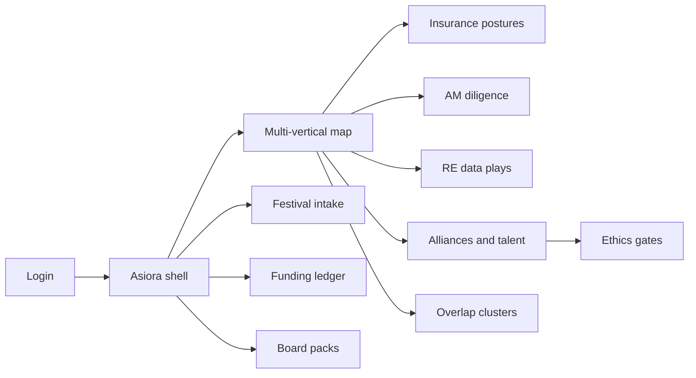
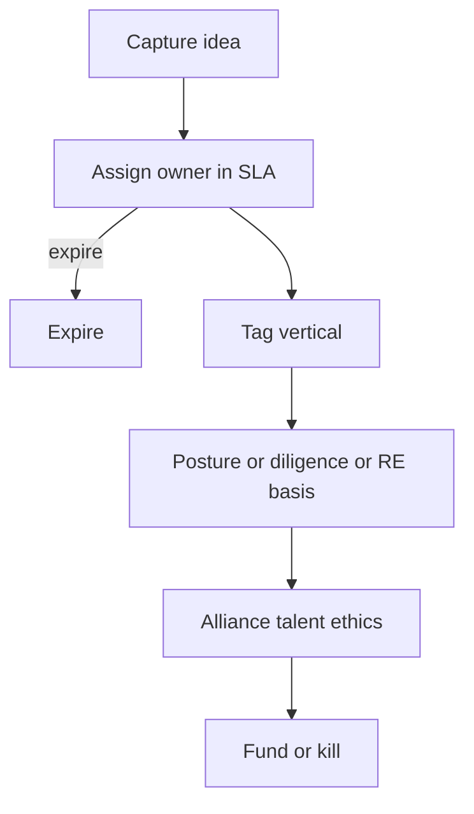

# Asiora — Web app

**Product:** [PRODUCT.md](./PRODUCT.md)
**Primary surface:** SEA multi-vertical transformation portfolio console (group strategy + insurance / AM / RE / AI alliance workspaces)
**Secondary surfaces:** Festival idea intake kiosk mode; board heatmap pack viewer (read-only)
**Design thesis:** Asiora is a regional war room for conglomerate bets — the UI metaphor is a four-vertical campaign map (insurance scenarios, AM operating/M&A moves, RE data plays, AI alliances), not a generic AI pilot catalogue. Visual language is deep teal and monsoon-ink on pale sand panels: unpostured insurance work feels unfinished; country localisation gaps feel like amber border marks; funding decisions feel stamped and final. The Asiora wordmark sits as a quiet regional seal on every heatmap and ledger screen so exco knows whose SEA portfolio truth they are arguing from.

## UX research synthesis

### Category peers (best-in-class)

- **Singapore FinTech Festival / MAS-facing strategy portals (operator patterns):** Idea capture under time pressure with forced ownership. Steal: intake SLA and expire-or-own; reject booth-brochure aesthetics as the ongoing console.
- **Insurance scenario planners (Deloitte/Accenture scenario kits in productised form):** Explicit future postures rather than “digital everything.” Steal: scenario chips as mandatory taxonomy (channel / machine-UW / flexible / E-Z life); reject maturity radars without posture.
- **Deal diligence workspaces (DealCloud / Midaxo-like M&A OS):** Diligence and integration checklists before capital commit. Steal: weak-diligence / integration-failure gates for AM M&A (BR-3); reject CRM-pipeline chrome for group strategy home.
- **Portiva-class AI portfolio OS (sibling category):** Stage-gate fund/kill discipline. Steal: immutable decisions and overlap clusters; reject collapsing Asiora into ai-only arcs — vertical + insurance scenario + RE localisation are the wedge.

### Patterns to adopt / reject

- **Adopt:** Primary vertical tags + cross-vertical deps; insurance scenario posture required; AM diligence/integration checklists; RE data source/consent/localisation/monetisation declarations; hub-vs-periphery alliance scores by country; talent gates; genomics/wellness ethics flags; consortium vs unilateral labels; festival intake SLA; multi-vertical board heatmap (not four appendices).
- **Reject:** Global WEF PDF copy-paste as UX; purple AI insight blobs; underwriting or OMS execution screens (BR-12); pet-project walls without posture; disconnected vertical dashboards as “the” home.

### Trust, density, and workflow constraints from PRODUCT.md

Vertical P&Ls resist group kills — scenario choice and overlaps must be visible at exco (change-management). SEA data localisation variance and alliance terms are need-to-know (BR-4, BR-5). Ethics on genomics/wellness before customer impact (BR-7). Talent gaps gate machine-UW and transformative AI (BR-6). Festival noise must become owned portfolio items or expire (BR-10). Board needs one multi-vertical heatmap (BR-11). Asiora does not underwrite, trade, or run property IoT (BR-12).

## Information architecture

### Nav model

### Roles → default home

| Role | Default home | Why |
|------|--------------|-----|
| Group strategy lead | Multi-vertical map | Stop double-funding journeys (BR-9, BR-11) |
| Insurance transformation | Insurance postures board | Force scenario choice (BR-2) |
| AM COO | AM diligence queue | Diligence before scale (BR-3) |
| RE services lead | RE data play register | Localisation/consent (BR-4) |
| Data alliance / AI lead | Alliance scores + talent gates | Hub-periphery and people (BR-5, BR-6) |
| Risk / ethics | Ethics flag queue | Genomics/wellness (BR-7) |
| Board strategy committee | Board heatmap viewer | Festival → governance |

### Cross-links to OpenAPI resources

| Nav area | OpenAPI tags / resources |
|----------|---------------------------|
| Initiatives / map | Initiatives |
| Insurance postures | Scenarios |
| AM diligence / integration | Diligence |
| Data alliances | Alliances |
| Talent / ethics gates | Gates |
| Fund / kill | Decisions |
| Festival ideas | Intakes |
| Board heatmaps | Packs |

## Screen inventory

### Multi-vertical map (home)

- **Purpose:** One composition: ai-ops, insurance, AM, RE bets with cross-links and capital — not four appendices.
- **Entry:** Group strategist default.
- **Layout regions:** Brand seal; vertical heatmap; cross-vertical dependency arcs; unpostured insurance count; intake SLA breach count; overlap alert rail; funding stage strip.
- **Primary actions:** Open initiative; resolve overlap; open intake queue; generate board pack.
- **Empty / loading / error:** Empty = capture first festival idea or file initiative; loading = skeleton map; error = retry with request id.
- **BR / story ties:** BR-1, BR-9, BR-11; group strategy stories.

### Initiative detail

- **Purpose:** Vertical tag, dependencies, scores, gates, and decision history for one bet.
- **Entry:** From map or intake conversion.
- **Layout regions:** Header (vertical, countries, owner); dependency list; posture/checklist panels by vertical; alliance/talent/ethics status; ledger slice.
- **Primary actions:** Assign posture; submit diligence; request funding; kill; attach consortium governance.
- **Empty / loading / error:** Missing vertical tag blocks save (BR-1).
- **BR / story ties:** BR-1, BR-8, BR-10.

### Insurance scenario board

- **Purpose:** Force channel / machine-UW / flexible product / E-Z life / hybrid postures — no generic “digital.”
- **Entry:** Insurance lead default.
- **Layout regions:** Scenario columns; unpostured lane (coral); experiment cards; ethics flag indicators for genomics/wellness.
- **Primary actions:** Set posture; fund experiment; open ethics review.
- **Empty / loading / error:** Unpostured items flagged and sorted first (BR-2).
- **BR / story ties:** BR-2, BR-7; insurance lead stories.

### AM diligence and integration gates

- **Purpose:** Enforce diligence and integration checklists before scale funding (survey failure modes).
- **Entry:** AM COO default; initiative AM path.
- **Layout regions:** Deal/initiative queue; diligence checklist completeness; integration risk (process, controls, data, metrics, talent, org); scale-fund lock until complete.
- **Primary actions:** Complete checklist; waive with dual-control; advance/kill.
- **Empty / loading / error:** Incomplete diligence = cannot scale-fund (BR-3).
- **BR / story ties:** BR-3; AM COO stories.

### RE data play register

- **Purpose:** Data sources, consent/localisation by market, monetisation hypothesis — “new gold” with regulatory footing.
- **Entry:** RE lead default.
- **Layout regions:** Play table; country localisation matrix; consent basis; monetisation hypothesis; cross-sell-allowed flag.
- **Primary actions:** Register play; update country basis; block silent siphon (cross-sell off).
- **Empty / loading / error:** Missing localisation = amber country marks (BR-4).
- **BR / story ties:** BR-4; RE services stories.

### Data alliance risk

- **Purpose:** Hub-vs-periphery scoring and regulatory feasibility by country for uneasy alliances.
- **Entry:** Alliance lead home.
- **Layout regions:** Alliance list; hub/periphery score; country feasibility; concentration warning.
- **Primary actions:** Score alliance; escalate; attach mitigation.
- **Empty / loading / error:** Unscored critical alliance = block transformative scale (BR-5).
- **BR / story ties:** BR-5; alliance lead stories.

### Talent and ethics gates

- **Purpose:** Talent coverage gates transformative AI/machine-UW; ethics flags for genomics/wellness before customer impact.
- **Entry:** Gates nav; initiative blockers.
- **Layout regions:** Talent gap vs policy; ethics case queue; waiver log; linked initiatives.
- **Primary actions:** Clear gate; open ethics review; grant recorded waiver.
- **Empty / loading / error:** Gap beyond policy = coral block (BR-6, BR-7).
- **BR / story ties:** BR-6, BR-7.

### Collective-solution labeling

- **Purpose:** Shared fraud/AML plays must name consortium governance or be labelled unilateral.
- **Entry:** From ai-ops initiatives tagged collective.
- **Layout regions:** Governance attachment; unilateral warning; partner list.
- **Primary actions:** Attach consortium model; relabel unilateral; proceed with disclosure.
- **Empty / loading / error:** Missing governance = amber mandatory field (BR-8).
- **BR / story ties:** BR-8.

### Festival / idea intake

- **Purpose:** Convert festival and external ideas to owned portfolio items within SLA or expire.
- **Entry:** Intake kiosk / strategist queue.
- **Layout regions:** Intake inbox; SLA countdown; owner assignment; convert-to-initiative; expire bin.
- **Primary actions:** Assign owner; convert; expire; merge duplicate.
- **Empty / loading / error:** SLA breach = coral queue priority (BR-10).
- **BR / story ties:** BR-10; board “festival noise” story.

### Overlap clusters

- **Purpose:** Same customer outcome across verticals — surface and resolve double-funding.
- **Entry:** Map alerts.
- **Layout regions:** Cluster card; member verticals; capital at risk; differentiation notes.
- **Primary actions:** Merge; kill member; keep with documented split.
- **Empty / loading / error:** Empty = healthy no-overlap message.
- **BR / story ties:** BR-9.

### Funding decision ledger

- **Purpose:** Immutable fund/kill/scale with rationale across verticals.
- **Entry:** Decisions nav; gate outcomes.
- **Layout regions:** Append-only ledger; vertical filters; dissent notes; export.
- **Primary actions:** Record decision; export for board.
- **Empty / loading / error:** Rows visually locked after stamp.
- **BR / story ties:** Funding governance; group strategy.

### Board heatmap packs

- **Purpose:** Multi-vertical heat + decisions in one pack — not four disconnected appendices.
- **Entry:** Pack publish; board reader.
- **Layout regions:** Heatmap page; kill/scale summary; alliance/talent/ethics excerpts; version history; read-only viewer.
- **Primary actions:** Generate; publish; download.
- **Empty / loading / error:** Stale actuals warning before publish (BR-11).
- **BR / story ties:** BR-11; board stories.

## Key flows

1. **Festival idea to funded experiment** — capture → assign owner in SLA → classify vertical → posture/checklist → score risks → fund or expire.

2. **Insurance posture funding** — declare scenario → ethics check if genomics/wellness → talent gate if machine-UW → fund experiment; failure: unpostured blocked.

3. **AM M&A scale gate** — diligence checklist → integration risk components → scale fund or kill (BR-3).

4. **RE data play registration** — sources → consent/localisation by country → monetisation hypothesis → approve for portfolio (BR-4).

5. **Cross-vertical overlap kill** — detect cluster → exco merge/kill → ledger stamp (BR-9).

## Design system

### Tokens (CSS variables)

- `--color-ink: #0E1C1F` — primary text
- `--color-sand: #F3EEE6` — panel ground
- `--color-teal: #0F3D3E` — shell / brand
- `--color-monsoon: #1F6F78` — interactive accent
- `--color-border-amber: #C4892A` — localisation / SLA provisional
- `--color-seal-coral: #C45C4A` — unpostured / ethics block
- `--color-stamp-green: #3A6B52` — funded / cleared
- `--color-steel: #667788` — secondary labels
- `--font-display: "Literata", "Source Serif 4", serif` — map titles and board pack heads
- `--font-body: "IBM Plex Sans", sans-serif` — console
- `--font-mono: "IBM Plex Mono", monospace` — decision ids, country codes
- `--space-1`…`--space-8`: 4px scale
- `--radius-sm: 4px`; `--radius-md: 8px`
- `--motion-stamp: 180ms ease-out` — funding lock
- `--motion-sla: 260ms ease-in-out` — intake SLA pulse
- `--motion-map: 200ms ease-out` — vertical heat reveal
- Atmosphere: sand panels on teal shell; subtle latitude-grid texture suggesting regional map; monsoon accent rules; no purple festival neon; no generic SaaS purple-indigo.

### Typography & brand

- Literata for heatmap titles; Plex Sans for tables; mono for country codes and decision ids.
- Asiora wordmark as regional seal on map and packs; login brand-first with headline (“One SEA portfolio across insurance, AM, RE, and AI”); one CTA.

### Do / don’t

- **Do:** Require insurance posture; show country localisation marks; lock funding decisions; one multi-vertical heatmap; expire unowned festival ideas.
- **Don’t:** Purple AI glow; four disconnected vertical homes as default; underwriting/OMS screens; editable ledger; emoji vertical pills; card walls of booth photos.

### Accessibility & domain trust cues

- Colour plus text for posture/localisation/ethics states; live regions for SLA breach and ethics flags.
- Focus order: intake → vertical classification → gates → decision → pack.
- Board viewer keyboard-complete; reduced-motion safe map transitions.

## Component patterns

- **VerticalHeatMap** — four verticals with capital and risk density.
- **InsurancePostureChip** — channel / machine-UW / flexible / E-Z / hybrid / unpostured.
- **DiligenceGatePanel** — AM diligence + integration completeness lock.
- **CountryLocalisationMatrix** — RE/alliance consent and localisation by market.
- **HubPeripheryScore** — alliance strategic position.
- **TalentEthicsGateBanner** — blocking gaps and genomics flags.
- **ConsortiumLabel** — collective vs unilateral governance.
- **IntakeSlaQueue** — festival ideas with expire countdown.
- **CrossVerticalOverlapCard** — shared customer outcome cluster.
- **BoardHeatPack** — single multi-vertical pack publisher.

## Out of scope for v1 web

- Policy underwriting engines; AM order management; property IoT networks; public festival website CMS; native mobile; executing customer financial transactions; replacing vertical core systems.
